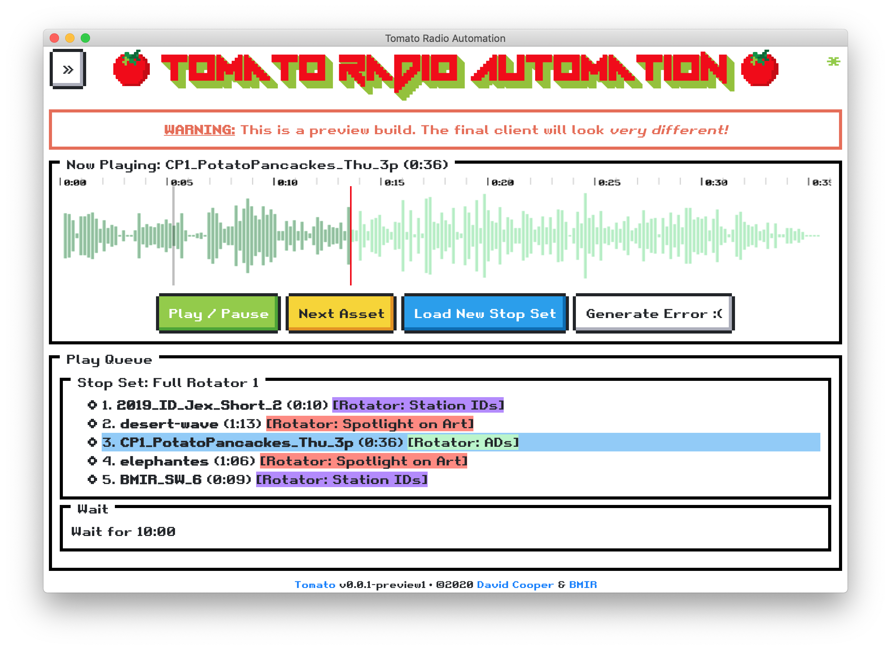
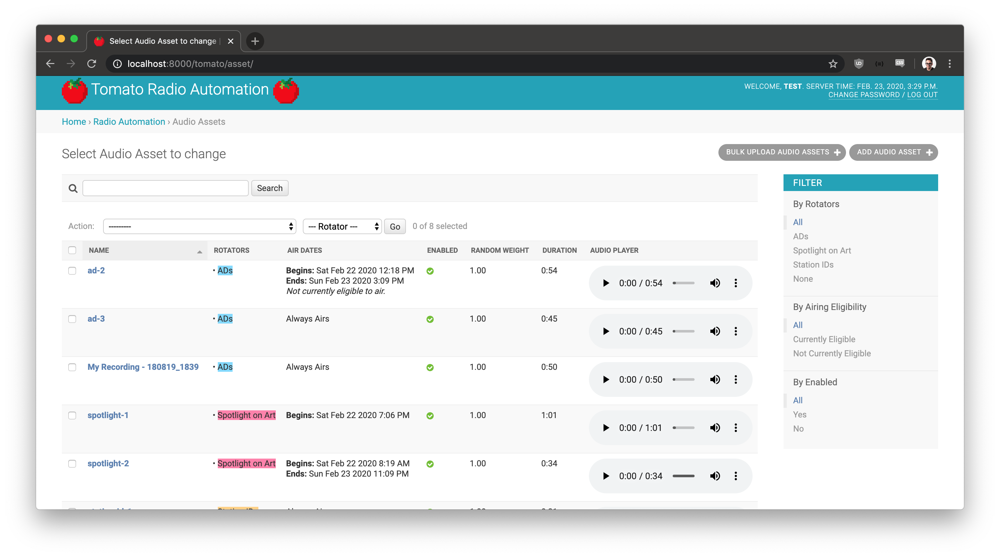

#  Tomato Radio Automation 

Client and server code for Tomato Radio Automation software. Simple, easy to use,
and hard to screw up Playout software written very specifically
for [Burning Man Information Radio](https://bmir.org/)'s use case (BMIR).

## Development

Tomato is in *active development* right now. So expect things to change and break.
Often.

## Client

Cross-platform (macOS/Windows/Linux), native Desktop application.

The client utilizes the following,

* [CEF Python](https://github.com/cztomczak/cefpython/), ie Python's bindings to
  the [Chromium Embedded Framework](https://bitbucket.org/chromiumembedded/cef).
* [NES.css](https://nostalgic-css.github.io/NES.css/) as a novel CSS library for
   most of the UI components.
* [wavesurfer.js](https://wavesurfer-js.org/) to play audio assets and render
   seekable audio waveforms in the UI.
* And others!

## Server

Server is a straightforward [Django](https://www.djangoproject.com/) app, taking full
advance of Django's admin interface.

## License

This project is licensed under the MIT License - see the [LICENSE](LICENSE) file
for details.

